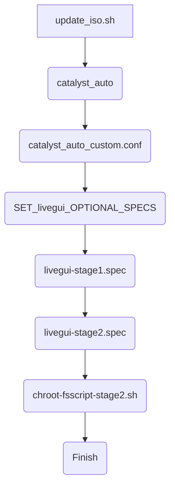

# Gentoo Custom Liveiso

Gentoo is releasing Liveiso build everyweek. the build system is called catalyst and 
the ochestrating catalyst for multiple architecture is called <b>catalyst-auto</b> in [releng](https://gitweb.gentoo.org/proj/releng.git/) repo.
this is customize catalyst-auto for apps on my own needs.

# To Build Liveiso
* Run on <b>gentoo</b> linux.
* To build liveiso, need to have at least <b>50Gb</b> of freespace.
* To build webkit, at least <b>50gb</b> of Memory space(include SWAP).

```bash
$ ./update_iso.sh
```

* After the build completes, the ISO file is located at <b>./catalyst/builds/default</b> directory. 

# Running in Docker

You could run the building processes in docker.
```bash
$ docker build -t gentoolive_img .
$ docker run -v ./:/gentoolive gentoolive_img
```

# Understading Build Order
The order of the build is defined in [catalyst-auto-custom.conf](catalyst-auto-custom.conf).



# How to Customize

## Using multiple CPUs

When building packages on catalyst, you could set <b>jobs</b> in [catalyst.conf](catalyst.conf) for how many processors you will using on building. 
```bash
jobs = 24 # to use 24 parallel processors
```

## Changing Package Repository

To change package repository, for installation repo. setting is located in [update_iso.sh](update_iso.sh)
```bash
REPO_URL="https://ftp.kaist.ac.kr/gentoo/releases/"
```

## Changing Liveiso Repository

To change Repository which used in liveiso, it is located in [fsscript-stage2.sh](specs/files/fsscript-stage2.sh)
```bash
[gentoo]
location = /var/db/repos/gentoo
sync-type = rsync
sync-uri = rsync://rsync.kr.gentoo.org/gentoo-portage
auto-sync = yes
sync-rsync-verify-jobs = 1
sync-rsync-verify-metamanifest = yes
sync-rsync-verify-max-age = 24
sync-openpgp-key-path = /usr/share/openpgp-keys/gentoo-release.asc
sync-openpgp-key-refresh-retry-count = 40
sync-openpgp-key-refresh-retry-overall-timeout = 1200
sync-openpgp-key-refresh-retry-delay-exp-base = 2
sync-openpgp-key-refresh-retry-delay-max = 60
sync-openpgp-key-refresh-retry-delay-mult = 4" > /etc/portage/repos.conf/gentoo.conf
```

## Changing Default Password
Password setup code stays in [fsscript-stage2.sh](specs/files/fsscript-stage2.sh)
```bash
yes root | passwd root
useradd gentoo
yes gentoo  | passwd gentoo
```

## Adding Overlays

In <b>update_iso.sh</b> script, the add/edit the part below.
```bash
folder="guru"
if ! git clone "https://github.com/gentoo-mirror/guru.git" "${folder}" 2>/dev/null && [ -d "${folder}" ] ; then
    pushd "$folder" >/dev/null
    git fetch -q
    popd >/dev/null
fi 
```

## Changing Packages to Install

You can add/remove gentoo packages in [livegui-stage1.spec](specs/livegui-stage1.spec). Full template is located at [livecd-stage1_tempalte.spec](specs/livegui-stage2.spec)

```
livecd/packages:
	# Xorg base
	sys-auth/seatd
	x11-base/xorg-server
	x11-apps/xrandr
```

If you got build error while changing packages, you could add/remove Use flags on the same file and <b>/specs/portage</b> directory. the directory is only used on building and it works exactly as gentoo [portage](https://wiki.gentoo.org/wiki/Portage) system.


## Custom Kernel Configs

catalyst-auto system uses kernel config from <b>releng</b> repository which states in <b>livegui-stage2.spec</b>. It is being copied when the stage starts. <b>update_iso.sh</b> scripts clone the releng copy and update every time it runs. need to put kernel configuration on the script.(need to be updated.)

```bash
# virtualbox-modules kernel patch
sed -i "s/# CONFIG_JUMP_LABEL is not set/CONFIG_JUMP_LABEL=y/" ./releng/releases/kconfig/amd64/amd64-6.1.38.config
```
## After Installation Process

After compile packages to install and kernel compile, the building system will run <b>fsscript-stage2.sh</b> as stated in <b>livegui-stge2.spec</b>. the script is for things todo for user directory configurations.

## Changing Kenel Module related Packages to Install

Some packages need to invoke on kernel compilations. you could add/remove the pacakges in [livegui-stage2.spec](specs/livegui-stage2.spec).

```
boot/kernel/gentoo/packages: --usepkg n zfs zfs-kmod net-misc/r8152 app-emulation/virtualbox app-emulation/virtualbox-additions app-emulation/virtualbox-modules net-misc/r8152
```

# Disclaimer
* ATM, it's working for <b>AMD64</b> build only.
* becareful with <b>emerge --sync</b> command. it may be streeful to gentoo git server. be sure to distribute your requests by using national mirror or local mirror.
* it is failed to boot on 13th Intel CPUs system. the error occurs when boot starts, shows, <b>/newroot/dev/tty0</b> file exists.

# Status
* <b>jwm</b> is for main windows manager. run with startx command.

# Todo
* there is error starting xdm on boot. related to displaymanager setting, terminal permissions.
* kernel config replacement on build starting.
* tui script or gui app for home dir changing helper.

# Related Projects
* [catalyst](https://gitweb.gentoo.org/proj/catalyst.git/) 
* [cloveros](https://gitgud.io/cloveros/cloveros.git)
* [gentoox](https://github.com/fatalhalt/gentoox.git)
* [mkg](https://github.com/fabnicol/mkg.git)
* [releng](https://gitweb.gentoo.org/proj/releng.git/)
* [lean-conkey-config](https://github.com/jxai/lean-conky-config)

